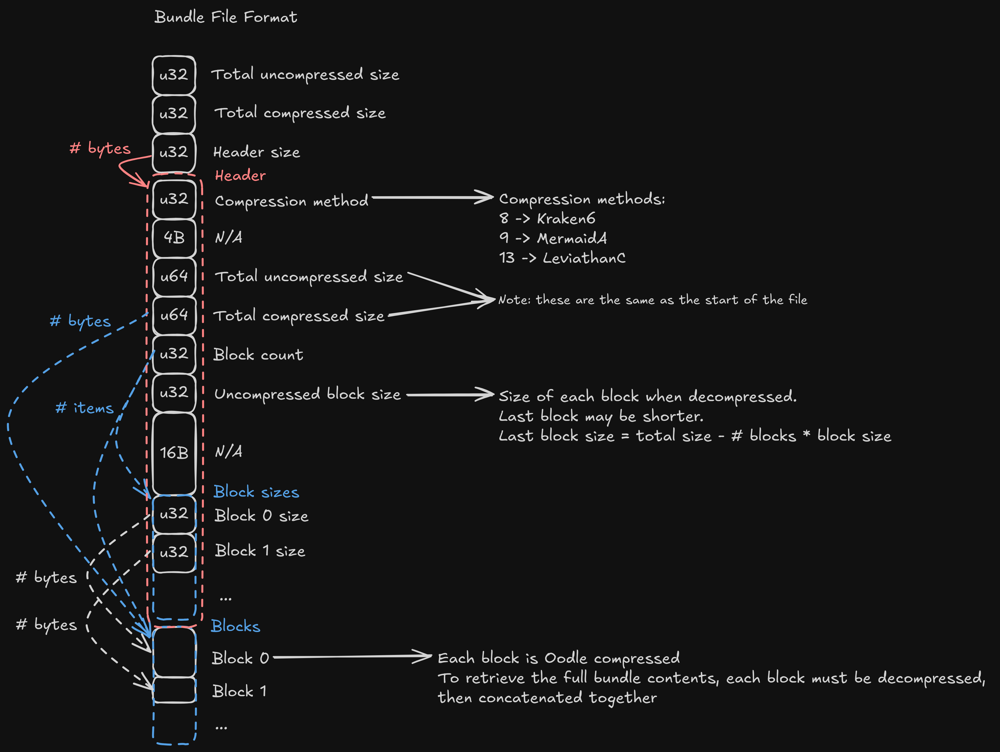
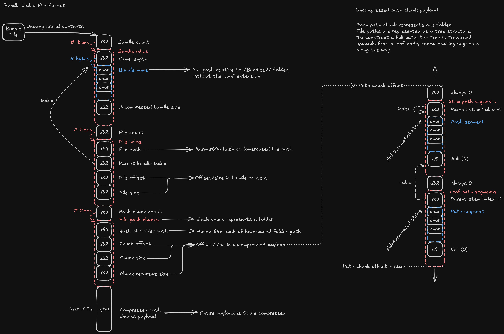

# Parsing tools for Path of Exile Bundle files

Tested on linux with the Steam version of PoE, patch 3.25.3.1

## Usage

From source (requires Rust to be installed)

```bash
cargo run --release --bin poe_files -- --help
```

Using executable file

```bash
poe_files --help
```

# Bundle File format



# Bundle Index File format



**TODO List**

- Directly use Murmur64A as the Hasher for my LUTs, rather than using the hashes as keys with the default Hasher
- Proper error propogation in the lib crate using Anyhow
- Proper documentation for the lib crate
