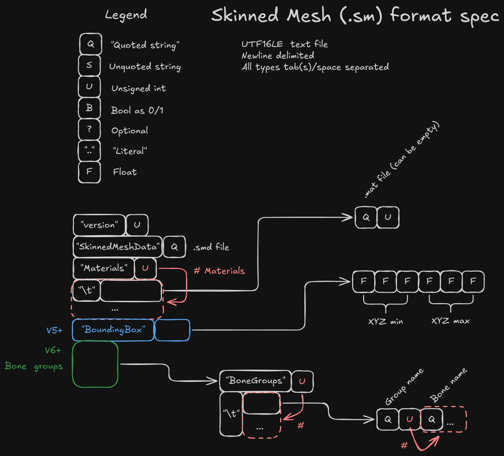
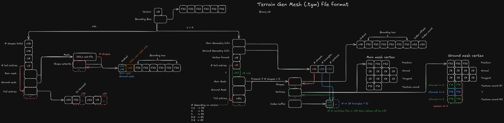
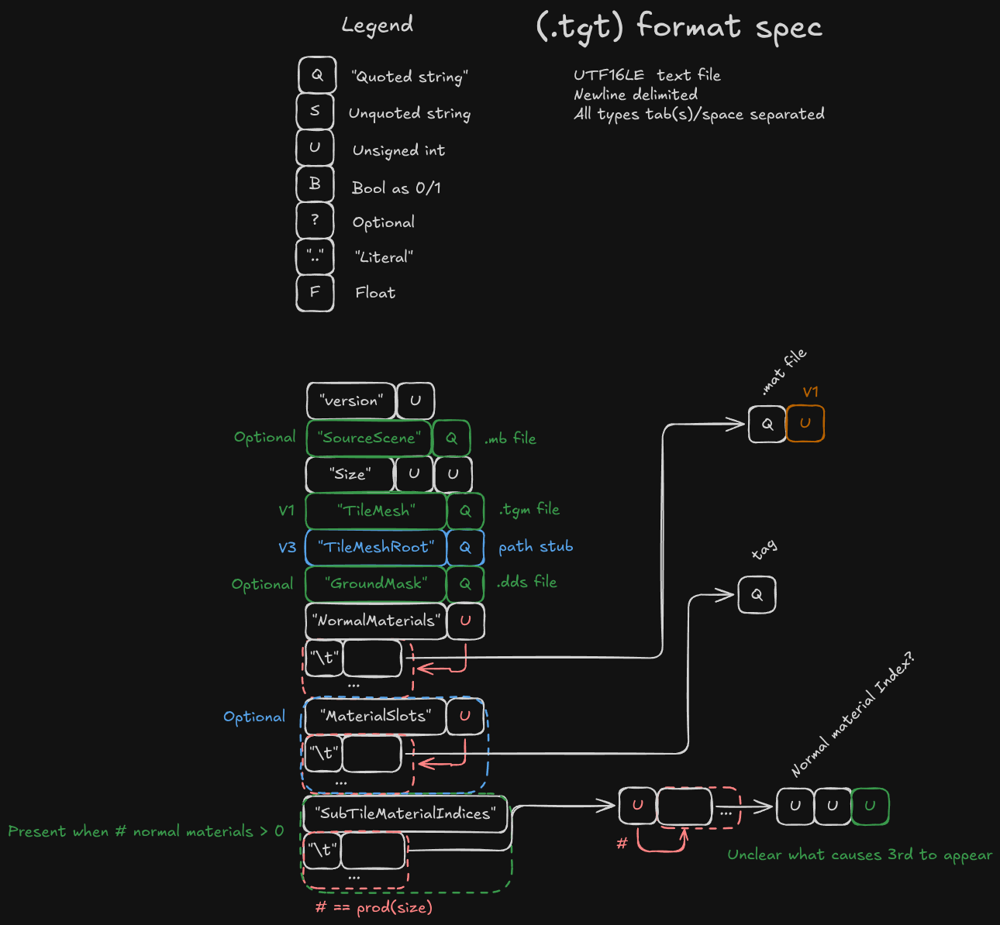

# PoE Data Tools
Parsing tools for Path of Exile game files. Available as a standalone binary (See releases), and as a rust crate.  

# Commands

- `list`: List the "virtual" file paths in the bundle
- `extract`: Extract the virtual files as-is, saving them as real files to disk
- `cat`: Dumps the binary contents of a file to stdout
- `dump-art`: Extracts DirectDraw Surface (.dds) files and converts them to PNGs
- `dump-tables`: Extracts data tables (.datc64), applies the [community-curated schemas](https://github.com/poe-tool-dev/dat-schema),
  and saves them out to more accessible formats.  
- `dump-tree`: Extracts passive skill trees (player, atlas, ruthless, etc.) to JSON
- `translate`: Extracts files and converts them to more accessible formats.  

## Usage

From source (requires Rust to be installed)

```bash
cargo run --release --bin poe_data_tools -- --help
```

Using executable file

```bash
poe_data_tools --help
```

As a rust library. Note that due to requiring a few forked dependencies, I can't yet publish it to crates.io. Instead, it must be added as a git dependency.  

```toml
[dependencies]
poe_data_tools = { git = "https://github.com/adamthedash/poe_data_tools.git" }
```

## Globs
Many of the commands can take glob patterns to operate over several files at once. Note that the patterns follow the [Unix glob](https://www.man7.org/linux/man-pages/man7/glob.7.html) specification.  
Several patterns can be provided at once.  

```bash
# all files in all directories (the default)
poe_data_tools --patch 2 list '**'
# all .datc64 and .dds files in all subdirectories
poe_data_tools --patch 2 list '**/*.datc64' '**/*.dds'
# all files in the art/ directory
poe_data_tools --patch 2 list 'art/*'
# all files in the art/ directory and its subdirectories
poe_data_tools --patch 2 list 'art/**'
```

# Format coverage
PoE 1 (patch 3.28.0.8), PoE Data Tools v1.7.1

|Format|Fail|Success|Total|Success %|
|-|-|-|-|-|
|amd   |     0| 19146| 19146|100.00%|
|ao    |     0| 61576| 61576|100.00%|
|arm   |     0| 22467| 22467|100.00%|
|cht   |     0|   602|   602|100.00%|
|clt   |     0|   328|   328|100.00%|
|dct   |     0|   471|   471|100.00%|
|ddt   |     0|   652|   652|100.00%|
|dlp   |     0|    84|    84|100.00%|
|ecf   |     1|   588|   589| 99.83%|
|epk   |     0|  8973|  8973|100.00%|
|et    |     0|  1440|  1440|100.00%|
|fmt   |     0| 33795| 33795|100.00%|
|gcf   |     0|     1|     1|100.00%|
|gft   |     0|   931|   931|100.00%|
|gt    |     0|  1104|  1104|100.00%|
|mat   |     0|143682|143682|100.00%|
|mtd   |     0|   891|   891|100.00%|
|pet   |     1| 37752| 37753|100.00%|
|psg   |     0|     7|     7|100.00%|
|rs    |     0|   989|   989|100.00%|
|smd   |     3| 33778| 33781| 99.99%|
|tmo   |     0|   155|   155|100.00%|
|toy   |     0|    47|    47|100.00%|
|trl   |     0|  6265|  6265|100.00%|
|tsi   |     0|  1087|  1087|100.00%|
|tst   |     0|   946|   946|100.00%|

<details>
<summary>By file format version</summary>

(fails : successes)
||Unknown|0|1|2|3|4|5|6|7|8|9|10|11|12|13|14|15|16|17|18|19|20|21|22|23|24|25|26|27|28|29|30|31|32|33|34|35|
|-|-|-|-|-|-|-|-|-|-|-|-|-|-|-|-|-|-|-|-|-|-|-|-|-|-|-|-|-|-|-|-|-|-|-|-|-|-|
|amd|||||0 : 12204|0 : 4685|0 : 2257||||||||||||||||||||||||||||||||
|ao|||||0 : 61576||||||||||||||||||||||||||||||||||
|arm||||||||||||||||0 : 110|0 : 2|0 : 25||0 : 73|0 : 7|0 : 36|0 : 45|0 : 3090|0 : 13|0 : 4||0 : 7690|0 : 1996|0 : 531|0 : 3304|0 : 1697|0 : 2641|0 : 160|0 : 7|0 : 2|0 : 203|0 : 831|
|cht||||0 : 601|0 : 1||||||||||||||||||||||||||||||||||
|clt||||0 : 2|0 : 36|0 : 290|||||||||||||||||||||||||||||||||
|dct||||0 : 471|||||||||||||||||||||||||||||||||||
|ddt|||||0 : 650|0 : 2|||||||||||||||||||||||||||||||||
|dlp|0 : 83|||0 : 1|||||||||||||||||||||||||||||||||||
|ecf|||1 : 588||||||||||||||||||||||||||||||||||||
|epk|0 : 8973||||||||||||||||||||||||||||||||||||||
|et|0 : 1440||||||||||||||||||||||||||||||||||||||
|fmt||||||||0 : 11017|0 : 5415|0 : 2435|0 : 14928||||||||||||||||||||||||||||
|gcf|||0 : 1||||||||||||||||||||||||||||||||||||
|gft|||0 : 2|0 : 929|||||||||||||||||||||||||||||||||||
|gt|0 : 1104||||||||||||||||||||||||||||||||||||||
|mat|0 : 143682||||||||||||||||||||||||||||||||||||||
|mtd|||||||0 : 891||||||||||||||||||||||||||||||||
|pet|0 : 17302|||0 : 3429|0 : 11351|1 : 2839|0 : 2831||||||||||||||||||||||||||||||||
|psg|||||0 : 7||||||||||||||||||||||||||||||||||
|rs||||0 : 989|||||||||||||||||||||||||||||||||||
|smd|||0 : 19461|3 : 1938|0 : 12379||||||||||||||||||||||||||||||||||
|tmo|||0 : 155||||||||||||||||||||||||||||||||||||
|toy|||0 : 47||||||||||||||||||||||||||||||||||||
|trl|0 : 3247|||0 : 2206||0 : 812|||||||||||||||||||||||||||||||||
|tsi|0 : 1087||||||||||||||||||||||||||||||||||||||
|tst|0 : 946||||||||||||||||||||||||||||||||||||||

</details>

PoE 2 (patch 4.4.0.11.2), PoE Data Tools v1.7.1

|Format|Fail|Success|Total|Success %|
|-|-|-|-|-|
|amd   |     0|  7982|  7982|100.00%|
|ao    |     0| 43953| 43953|100.00%|
|arm   |     0|  8140|  8140|100.00%|
|cht   |     1|   146|   147| 99.32%|
|clt   |     0|   116|   116|100.00%|
|dct   |     0|   116|   116|100.00%|
|ddt   |     0|   118|   118|100.00%|
|dlp   |     0|    95|    95|100.00%|
|ecf   |     0|   160|   160|100.00%|
|epk   |     0|  4414|  4414|100.00%|
|et    |     0|   817|   817|100.00%|
|fmt   |     0| 13639| 13639|100.00%|
|gft   |     0|   255|   255|100.00%|
|gt    |     0|   393|   393|100.00%|
|mat   |     0| 91525| 91525|100.00%|
|mtd   |     0|   275|   275|100.00%|
|pet   |     0| 19962| 19962|100.00%|
|psg   |     0|     2|     2|100.00%|
|rs    |     0|   273|   273|100.00%|
|smd   |     7| 16372| 16379| 99.96%|
|tmo   |     0|   225|   225|100.00%|
|toy   |     0|    92|    92|100.00%|
|trl   |     0|  3348|  3348|100.00%|
|tsi   |     0|   287|   287|100.00%|
|tst   |     0|   255|   255|100.00%|

<details>
<summary>By file format version</summary>

(fails : successes)
||Unknown|0|1|2|3|4|5|6|7|8|9|10|11|12|13|14|15|16|17|18|19|20|21|22|23|24|25|26|27|28|29|30|31|32|33|34|35|
|-|-|-|-|-|-|-|-|-|-|-|-|-|-|-|-|-|-|-|-|-|-|-|-|-|-|-|-|-|-|-|-|-|-|-|-|-|-|
|amd|||0 : 1685|0 : 162|0 : 1381|0 : 2879|0 : 1875||||||||||||||||||||||||||||||||
|ao||||0 : 43953|||||||||||||||||||||||||||||||||||
|arm||||||||||||||||||||0 : 1||0 : 2||0 : 33||||0 : 23|0 : 4|0 : 5|0 : 239|0 : 105|0 : 602|0 : 38|0 : 6||0 : 506|0 : 6576|
|cht||||1 : 118|0 : 28||||||||||||||||||||||||||||||||||
|clt|||||0 : 4|0 : 112|||||||||||||||||||||||||||||||||
|dct||||0 : 116|||||||||||||||||||||||||||||||||||
|ddt|||||0 : 80|0 : 38|||||||||||||||||||||||||||||||||
|dlp|0 : 7|||0 : 15|0 : 73||||||||||||||||||||||||||||||||||
|ecf|||0 : 160||||||||||||||||||||||||||||||||||||
|epk|0 : 4414||||||||||||||||||||||||||||||||||||||
|et|0 : 817||||||||||||||||||||||||||||||||||||||
|fmt||||||0 : 940|0 : 166|0 : 1496|0 : 1370|0 : 475|0 : 9192||||||||||||||||||||||||||||
|gft||||0 : 255|||||||||||||||||||||||||||||||||||
|gt|0 : 393||||||||||||||||||||||||||||||||||||||
|mat|0 : 91525||||||||||||||||||||||||||||||||||||||
|mtd|||||||0 : 275||||||||||||||||||||||||||||||||
|pet|0 : 6010|||0 : 1444|0 : 4995|0 : 2613|0 : 4900||||||||||||||||||||||||||||||||
|psg|||||0 : 2||||||||||||||||||||||||||||||||||
|rs||||0 : 273|||||||||||||||||||||||||||||||||||
|smd|||0 : 2907|1 : 185|6 : 13280||||||||||||||||||||||||||||||||||
|tmo|||0 : 225||||||||||||||||||||||||||||||||||||
|toy|||0 : 92||||||||||||||||||||||||||||||||||||
|trl|0 : 1286|||0 : 908|0 : 3|0 : 1151|||||||||||||||||||||||||||||||||
|tsi|0 : 287||||||||||||||||||||||||||||||||||||||
|tst|0 : 255||||||||||||||||||||||||||||||||||||||

</details>

# GGPK File Format


# Bundle File Format


# Bundle Index File Format


# World Area related files
  

## AMD File Format
  

## AO File Format
  

## ARM File Format
  

## CHT File Format
  

## CLT File Format
  

## DCT File Format
  

## DDT File Format
  

## DOLm Sub-File Format
  

## DLP File Format
  

## ECF File Format
  

## ET File Format
  

## EPK File Format
  

## FMT File Format
  

## GCF File Format
  

## GFT File Format
  

## GT File Format
  

## MAT File Format
  

## MTD File Format
  

## PET File Format
  

## PSG File Format
  

## RS File Format
  

## SM File Format
  

## SMD File Format
  

## TGM File Format
  

## TGT File Format
  

## TMO File Format
  

## TOY File Format
  

## TRL File Format
  

## TSI File Format
  

## TST File Format
  

# TODO List

- Proper documentation for the lib crate
- Swap image.rs version once [DDS support is merged](https://github.com/image-rs/image/pull/2258)

# Resources
https://gitlab.com/zao/poe-rs  
https://gist.github.com/zao/96cb1869db121fbd038f8cd66f7d5736 - for .fmt/tdt/tgm  
https://gitlab.com/zao/poe-cpp/-/tree/master/libpoe/poe/format  
https://bitbucket.org/zao/gggtools/src/evolve-ggpkviewer/spec/  


```
.act = Actor, UCS-2 plain
.ais = AI Script, UCS-2 plain
.amd = Animated Meta Data, UCS-2 plain
.ao = Animated Object, UCS-2 plain
.aoc = Animated Object Controller, UCS-2 plain
.arm = Rooms, UCS-2 plain
.ast = Skeleton, Binary
.bank = FMOD Sound Bank, Binary
.bk2 = Bink Video, Binary
.cht = Chest Data, UCS-2 plain
.dat = Game Data
.dat64 = Game Data 64bits
.dds = Texture, brotli compress or soft link
.ddt = Doodads, UCS-2 plain
.dlp = Doodads, UCS-2 plain
.dgr = Digital Graph Document, UCS-2 plain
.env = Environments, UCS-2 plain
.filter = Loot Filter, UTF-8
.ffx = FFX Render, UCS-2 plain
.fx = Shader, Ascii
.gm = Grandmaster, Binary
.gt = Ground Types, UCS-2 plain
.hlsl = Shader, Ascii
.mat = Material, UCS-2 plain
.ogg = Digital Multimedia, Binary
.ot = Object Type, UCS-2 plain
.otc = Object Type Codes, UCS-2 plain
.pet = Particle Effect, Binary
.pjd = Passive Jewel Data, Binary
.psg = Passive Skill Graphic, Binary
.rs = Room Set, UCS-2 plain
.sm = Skin Mesh, UCS-2 plain
.smd = Skin Mesh Data, binary
.spritefont = Raster Font Data, Binary
.tgt = Tile Group, UCS-2 plain
.txt = Text, UCS-2 plain
.ui = User Interface, UCS-2 plain
```
